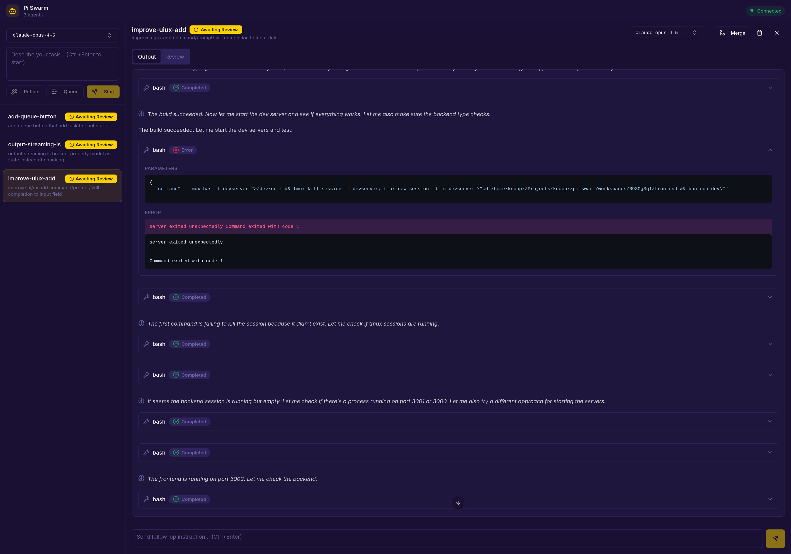

# Pi Swarm

Multi-agent orchestration for pi coding agents. Each agent works in an isolated jujutsu workspace, and you can merge changes back to the main workspace when ready.



## Features

- **Parallel Agents**: Run multiple pi agents simultaneously
- **Isolated Workspaces**: Each agent works in its own jujutsu workspace
- **Real-time Updates**: See agent output, modified files, and diffs in real-time
- **Intercept & Instruct**: Send new instructions to running agents
- **Merge Changes**: Incorporate agent changes to main workspace with jj squash
- **Code Review**: Review diffs before merging
- **Jujutsu Integration**: View jj status and revision log per agent
- **Persistent State**: Agent state persists across restarts

## Architecture

```
┌─────────────────────────────────────────────────────────────┐
│                      React Frontend                          │
│  (Agent cards, status, output, diffs, review mode)          │
└─────────────────────────────────────────────────────────────┘
                              │
                              ▼
┌─────────────────────────────────────────────────────────────┐
│                    Bun + Pi SDK Backend                      │
│  (REST API, Agent Sessions, Workspace Management)           │
└─────────────────────────────────────────────────────────────┘
                              │
            ┌─────────────────┼─────────────────┐
            ▼                 ▼                 ▼
    ┌───────────────┐ ┌───────────────┐ ┌───────────────┐
    │   Agent 1     │ │   Agent 2     │ │   Agent N     │
    │ (jj workspace)│ │ (jj workspace)│ │ (jj workspace)│
    │  Pi Session   │ │  Pi Session   │ │  Pi Session   │
    └───────────────┘ └───────────────┘ └───────────────┘
```

## Prerequisites

- [jujutsu](https://github.com/jj-vcs/jj) (jj)
- [Bun](https://bun.sh)
- [pi coding agent](https://github.com/badlogic/pi-mono)

## Installation

### Run directly with bunx (recommended)

```bash
bunx github:knoopx/pi-swarm
```

### Install globally

```bash
bun add -g github:knoopx/pi-swarm
pi-swarm
```

### Development

1. **Install dependencies**:

   ```bash
   bun install
   cd src/frontend && bun install
   ```

2. **Start dev server** (with hot reload):

   ```bash
   bun run dev
   ```

3. **Or build and start**:

   ```bash
   bun run start
   ```

4. **Open in browser**: http://localhost:3001

## Development

For development with hot-reload:

```bash
# Start both backend and frontend in dev mode
bun run dev
```

Then open http://localhost:3001 (Vite dev server runs on 3000, backend proxies to it).

## API Endpoints

| Method | Endpoint                   | Description              |
| ------ | -------------------------- | ------------------------ |
| GET    | `/api/agents`              | List all agents          |
| GET    | `/api/agents/:id`          | Get agent with status    |
| POST   | `/api/agents`              | Create new agent         |
| POST   | `/api/agents/:id/start`    | Start agent execution    |
| POST   | `/api/agents/:id/stop`     | Stop running agent       |
| POST   | `/api/agents/:id/instruct` | Send new instruction     |
| GET    | `/api/agents/:id/diff`     | Get full workspace diff  |
| POST   | `/api/agents/:id/merge`    | Merge changes to main    |
| DELETE | `/api/agents/:id`          | Delete agent & workspace |

## How It Works

1. **Create Agent**: Specify an instruction (name is auto-generated)
2. **Workspace Creation**: A jujutsu workspace is created linked to the base repo
3. **Agent Execution**: Pi SDK creates an agent session in the workspace
4. **Monitor Progress**: View output, modified files, jj status/log in real-time
5. **Intercept**: Send new instructions to modify agent behavior
6. **Review**: Review the diff before merging
7. **Merge**: Use `jj squash` to incorporate changes back to main workspace

## Project Structure

```
pi-swarm/
├── bin/pi-swarm.ts           # CLI entry point
├── src/
│   ├── server.ts             # Elysia API server with Pi SDK
│   ├── core.ts               # Core types and helpers
│   ├── server-logic.ts       # WebSocket message handling
│   ├── *.test.ts             # Tests
│   └── frontend/             # React frontend
│       └── src/
│           ├── components/   # React components
│           ├── lib/          # Utilities and state
│           └── App.tsx       # Main app
├── dist/                     # Built frontend (created on install)
├── .pi/swarm/                # Runtime data (created per-project)
│   ├── sessions/             # Agent sessions
│   │   └── <agent-id>/       # Per-agent session & metadata
│   └── workspaces/           # Agent jj workspaces
└── package.json
```

## Future Improvements

- [ ] WebSocket/SSE for real-time streaming instead of polling
- [ ] Agent task queue with dependencies
- [ ] Conflict detection before merge
- [ ] Agent templates/presets
